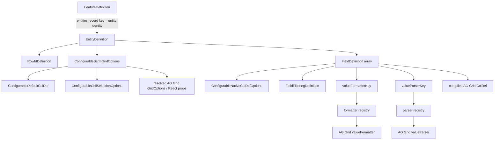

# Configurable Feature Type Hierarchy and AG Grid Mapping

Quick architecture/type map for `frontend/src/shared/grid/configurable/configuration.types.ts`.

The text hierarchy is the portable source of truth for this visual document. Mermaid remains supplemental because not every viewer renders it.

## Current hierarchy

```text
FeatureDefinition
├── featureKey
└── entities: Record<entityKey, EntityDefinition>
    │
    │  entityKey is the business/config identity
    │  e.g. "transaction", "loan", "finance"
    │
    └── EntityDefinition
        ├── labelKey
        ├── dataAdapterKey
        ├── rowId: RowIdDefinition
        │   └── path
        ├── gridOptions?: ConfigurableSsrmGridOptions
        │   ├── defaultColDef?: ConfigurableDefaultColDef
        │   │   └── native JSON-safe ColDef properties
        │   ├── pagination / cache native SSRM options
        │   ├── cellSelection?: boolean | ConfigurableCellSelectionOptions
        │   │   └── handle?: range | fill
        │   ├── invalidEditValueMode?
        │   ├── singleClickEdit? / suppressClickEdit?
        │   ├── stopEditingWhenCellsLoseFocus?
        │   ├── undoRedoCellEditing? / undoRedoCellEditingLimit?
        │   ├── suppressClipboardPaste?
        │   └── rowHeight? / headerHeight? / animateRows?
        └── fields: FieldDefinition[]
            ├── colId                  ← ColDef.colId
            ├── field                  ← ColDef.field
            ├── labelKey               → translation → ColDef.headerName
            ├── cellDataType           ← ColDef.cellDataType
            ├── native ColDef options  ← ConfigurableNativeColDefOptions
            │   ├── sorting / sizing / pinning / wrapping
            │   ├── editable
            │   ├── cellEditor
            │   ├── cellEditorParams
            │   ├── cellEditorPopup
            │   ├── cellEditorPopupPosition
            │   ├── singleClickEdit
            │   ├── suppressPaste / suppressFillHandle
            │   ├── useValueParserForImport
            │   ├── cellRenderer
            │   └── cellRendererParams
            ├── filtering?: FieldFilteringDefinition
            │   └── filterOptions      → filterParams.filterOptions
            ├── valueFormatterKey?     → formatter registry → ColDef.valueFormatter
            ├── valueFormatterConfig?
            ├── valueParserKey?        → parser registry → ColDef.valueParser
            └── valueParserConfig?
```

There is deliberately **no** configurable `editing: { editor, parser }` wrapper. AG Grid's own editing/column properties stay flat when their persisted values are safely representable.

## What the generics do — and do not do

A generated TypeDoc heading such as:

```text
EntityDefinition<TLabelKey, TFieldDefinition>
```

does **not** mean Transaction/Loan identity comes from those generic parameters.

```text
FeatureDefinition.entities record key
→ entity business/config identity
→ "transaction" / "loan" / "finance"

EntityDefinition<TLabelKey, TFieldDefinition>
→ only narrows allowed label keys and field shape
→ remains reusable and business-agnostic
```

## Supplemental Mermaid relationship view



## Mandatory normalization boundary

```text
backend/database representation
        ↓
validate + normalize/adapt ALWAYS
        ↓
normalized frontend configuration
        ↓
compiler + registries + runtime policy
        ↓
final AG Grid GridOptions / ColDef / callbacks / components
```

Normalization remains even when backend/storage names currently equal normalized frontend names. A backend rename is mapped once at this boundary; the compiler does not change.

## Native naming rule

```text
same AG Grid concept + same persisted value semantics
→ use AG Grid property name
→ reuse/derive AG Grid type where practical

AG Grid supports a JSON-safe registered component name
→ keep native cellEditor / cellRenderer property
→ validate the name against frontend registrations

AG Grid expects executable function/expression semantics
→ do not persist raw executable value
→ use an explicit frontend registry key/config descriptor
```

### Direct native examples

```text
gridOptions.defaultColDef
gridOptions.pagination
gridOptions.cacheBlockSize
gridOptions.cellSelection
gridOptions.invalidEditValueMode
colId
field
cellDataType
editable
cellEditor
cellEditorParams
cellEditorPopup
cellEditorPopupPosition
singleClickEdit
suppressPaste
suppressFillHandle
cellRenderer
cellRendererParams
```

### Intentionally application-specific examples

```text
featureKey
entities
labelKey
dataAdapterKey
rowId
filtering
valueFormatterKey / valueFormatterConfig
valueParserKey / valueParserConfig
```

`filtering` remains application-specific because its persisted meaning is server-query support, not merely choosing an AG Grid filter UI component.

## Editing mapping after the native-first SSRM spike

The merged `/ssrm-native-editing` spike proved that normal edit propagation belongs to AG Grid:

```text
normal cell edit
Cell Selection
Ctrl/Cmd+D
Ctrl/Cmd+Enter
Fill Handle
clipboard/paste
        ↓
AG Grid applies native editable rules
        ↓
cellValueChanged
        ↓
shared BASE + LOCAL draft observer
```

The configurable contract therefore describes the native options rather than recreating those interactions:

```text
field.editable                  → composed ColDef.editable
field.cellEditor                → ColDef.cellEditor
field.cellEditorParams          → ColDef.cellEditorParams
field.cellEditorPopup           → ColDef.cellEditorPopup
field.cellEditorPopupPosition   → ColDef.cellEditorPopupPosition
field.singleClickEdit           → ColDef.singleClickEdit
field.suppressPaste             → ColDef.suppressPaste
field.suppressFillHandle        → ColDef.suppressFillHandle
field.useValueParserForImport   → ColDef.useValueParserForImport

gridOptions.cellSelection      → GridOptions.cellSelection
gridOptions.invalidEditValueMode
                                → GridOptions.invalidEditValueMode
gridOptions.suppressClipboardPaste
                                → GridOptions.suppressClipboardPaste
```

`CellSelectionModule`, `ClipboardModule`, `serverSideDatasource`, runtime `context`, event callbacks and `GridApi` are runtime/bundle infrastructure, even though React accepts them as grid props.

## Registered component names vs executable registries

AG Grid can select registered editors/renderers by string name, so these remain native:

```text
cellEditor: "transactionAccountEditor"
cellRenderer: "statusChip"
```

The frontend owns the actual React/component registrations.

AG Grid `valueFormatter` and `valueParser` accept functions/expressions rather than component registry names, so persisted config uses explicit safe keys:

```text
valueFormatterKey
→ frontend formatter registry
→ ColDef.valueFormatter

valueParserKey
→ frontend parser registry
→ ColDef.valueParser
```

Raw AG Grid expression strings are not accepted from backend configuration.

## Grid-level merge structure

```text
application/configurable SSRM defaults
        +
entity.gridOptions overrides
        ↓
resolved GridOptions

resolved GridOptions.defaultColDef
        +
individual FieldDefinition native properties
        ↓
final ColDef
```

`defaultColDef` now lives under `gridOptions` because that is where AG Grid defines it.

## Runtime editing state is not configuration

The merged native-first spike's generic draft state is a runtime/shared mechanic:

```text
rowId
└── dirty field
    ├── baseValue
    └── value
```

It is not persisted configurable metadata. Neither are dirty counts, selected∩dirty calculation, Save acknowledgement, SSRM draft restoration or Discard refresh behavior.

## Generated API docs

TypeDoc + `typedoc-plugin-markdown` are configured through root `typedoc.json` and:

```bash
npm run docs:configurable
```

Whenever `configuration.types.ts` or its JSDoc changes, regenerate `docs/configurable-feature/generated/` before treating generated API pages as current.
