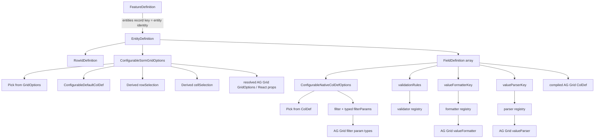

# Configurable Feature Type Hierarchy and AG Grid Mapping

Quick architecture/type map for `frontend/src/shared/grid/configurable/configuration.types.ts` and the implemented configurable SSRM compiler.

The text hierarchy is the portable source of truth for this visual document. Mermaid remains supplemental because not every viewer renders it.

## Current hierarchy

```text
FeatureDefinition
├── featureKey
└── entities: Record<entityKey, EntityDefinition>
    │
    │  entityKey = business/config identity
    │  e.g. "transaction", "loan", "finance"
    │
    └── EntityDefinition
        ├── labelKey
        ├── dataAdapterKey
        ├── rowId: RowIdDefinition
        │   └── path
        ├── gridOptions?: ConfigurableSsrmGridOptions
        │   ├── Pick<GridOptions, reviewed native keys>
        │   ├── defaultColDef?: ConfigurableDefaultColDef
        │   │   └── ConfigurableNativeColDefOptions
        │   ├── rowSelection?: derived native flat-SSRM selection
        │   └── cellSelection?: derived native range/fill selection
        └── fields: FieldDefinition[]
            ├── ConfigurableNativeColDefOptions
            │   ├── Pick<ColDef, reviewed native keys>
            │   ├── Extract safe boolean branches from callback unions
            │   ├── filter + typed filterParams
            │   └── native named editor/renderer + JSON-safe params
            ├── colId                  ← ColDef.colId
            ├── field                  ← ColDef.field
            ├── labelKey               → translation → ColDef.headerName
            ├── cellDataType           ← BaseCellDataType
            ├── validationRules?       → validator registry → native editor validation
            ├── valueFormatterKey?     → formatter registry → ColDef.valueFormatter
            ├── valueFormatterConfig?
            ├── valueParserKey?        → parser registry → ColDef.valueParser
            └── valueParserConfig?
```

There is deliberately no configurable `editing: { editor, parser }`, `renderer: { key }`, or `filtering: { ... }` wrapper. Native AG Grid properties stay flat whenever their persisted values are safely representable.

## What the generics do — and do not do

```text
FeatureDefinition.entities record key
→ entity business/config identity
→ "transaction" / "loan" / "finance"

EntityDefinition<TLabelKey, TFieldDefinition>
→ only narrows allowed label keys and field shape
→ remains reusable and business-agnostic
```

## Supplemental Mermaid relationship view



## Mandatory normalization boundary

```text
backend/database representation
        ↓
validate + normalize/adapt ALWAYS
        ↓
normalized frontend configuration
        ↓
compiler + registries + runtime policy
        ↓
final AG Grid GridOptions / ColDef / callbacks / components
```

Normalization remains even when backend/storage names currently equal normalized frontend names. Compile-time AG Grid type derivation does not make backend JSON trusted.

The implemented normalizer receives `unknown`, rejects unsupported keys and executable/non-JSON values, validates the current bounded native enum/union branches, validates type-specific filter semantics, and deep-clones accepted JSON before the compiler sees it.

## Native naming + type derivation rule

```text
same AG Grid concept + same persisted value semantics
→ use AG Grid property name

precise AG Grid public type exists
→ use directly
→ BaseCellDataType / ISimpleFilterModelType

reviewed group of native members
→ Pick<ColDef | GridOptions, ReviewedKeys>

native member has declarative + executable branches
→ Extract the safe branch

nested native object has one executable member
→ derive the native object
→ Omit only that executable member
```

Do not hand-copy a long list as individual `ColDef['key']` / `GridOptions['key']` declarations when `Pick` expresses the relationship. Also do not use a broad negative `Omit` for the whole persisted surface: explicit `Pick` means a future AG Grid upgrade cannot silently expose newly-added runtime/callback properties.

## Grid options: configurable vs runtime-owned

Examples of current native configurable grid properties:

```text
defaultColDef
pagination / paginationAutoPageSize / paginationPageSize
cacheBlockSize / maxBlocksInCache / serverSideInitialRowCount
rowSelection
cellSelection
invalidEditValueMode
singleClickEdit / suppressClickEdit
enterNavigatesVertically / enterNavigatesVerticallyAfterEdit
undoRedoCellEditing
suppressClipboardPaste
suppressMovableColumns / suppressMoveWhenColumnDragging
rowHeight / rowBuffer / headerHeight / animateRows
tooltipShowDelay / tooltipHideDelay / tooltipInteraction
suppressCellFocus / suppressHeaderFocus / ensureDomOrder
```

Runtime/bundle infrastructure remains frontend-owned even though `AgGridReact` accepts it as props:

```text
modules
rowModelType
serverSideDatasource
columnDefs
context
getRowId callback
event callbacks
GridApi refs
business callbacks such as isRowSelectable/getRowClass
```

The implemented compiler intentionally returns only declarative/runtime-safe `GridOptions`, final `ColDef[]`, compiled row-ID accessors and frontend component registrations. The concrete configurable root still visibly owns the SSRM datasource, modules and lifecycle.

## Native flat-SSRM row selection

The normalized selection type is derived from `GridOptions['rowSelection']` rather than recreated locally:

```text
Extract singleRow branch
Extract multiRow branch
Pick common native declarative members
Extract checkboxes boolean branch

multiRow:
Pick headerCheckbox / ctrlASelectsRows
Extract selectAll = all
```

`isRowSelectable` remains runtime business policy.

`groupSelects` is intentionally absent from the current configurable contract because the target runtime is flat SSRM. It should return with actual server-side grouping support rather than being exposed only to carry the default `'self'` value.

AG Grid treats `rowSelection.selectAll='filtered'|'currentPage'` as invalid for SSRM, so those are not accepted as native config. The repository's All Filtered / Current Page operations remain application-owned semantics.

The defaults compiler merges selection only while the native discriminated `mode` remains the same. Switching between `singleRow` and `multiRow` replaces the branch so multi-row-only members cannot leak into a single-row configuration.

## Cell Selection / range-fill types

Cell Selection is derived from `GridOptions['cellSelection']`:

```text
Pick native declarative top-level members
        ↓
Extract native range handle
Extract native fill handle
        ↓
Omit fill.setFillValue only
```

`setFillValue` is executable frontend behavior. The native range/fill shape, mode, direction and other declarative handle members stay AG Grid-owned.

Implemented merge semantics preserve the native discriminated shape: boolean `cellSelection` replaces an object branch, object options merge, and a handle merges only when its `mode` stays the same. Switching `range` ↔ `fill` replaces the handle branch.

## Native server-backed filtering

```text
field.filter
→ native AG Grid filter name / boolean

field.filterParams
→ ConfigurableFilterParamsForCellDataType
→ AG Grid ITextFilterParams / INumberFilterParams /
   IBigIntFilterParams / IDateFilterParams-derived safe members
```

Operator keys come from `ISimpleFilterModelType` and are narrowed to the active server-adapter contract.

Current common contract:

```text
Text       → contains / equals / notEqual / startsWith / endsWith
Number     → equals / notEqual / greaterThan / greaterThanOrEqual / lessThan / lessThanOrEqual
BigInt     → same operator vocabulary as Number
Date/time  → equals / notEqual / lessThan / greaterThan
Boolean    → equals / notEqual
```

Common filter behavior stays native:

```text
buttons
closeOnApply
debounceMs
readOnly
filterPlaceholder string
maxNumConditions = 1
```

Type-specific UI-safe native members are derived from AG Grid types. Executable callbacks and server-semantic toggles that the current filter model/backend does not represent remain excluded.

There is no parallel `FieldFilteringDefinition` anymore.

The compiler does not infer backend field/operator mapping. The first Transaction consumer continues to use `mapTransactionGridRequest`, so server semantics remain feature/backend-owned.

## Editing mapping after the native-first SSRM spike

```text
normal cell edit
Cell Selection
Ctrl/Cmd+D
Ctrl/Cmd+Enter
Fill Handle
clipboard/paste
        ↓
AG Grid applies native editable + editor validation rules
        ↓
cellValueChanged
        ↓
shared BASE + LOCAL draft observer
```

The configurable contract therefore describes native behavior:

```text
field.editable                  → composed ColDef.editable
field.cellEditor                → ColDef.cellEditor
field.cellEditorParams          → ColDef.cellEditorParams
field.cellEditorPopup           → ColDef.cellEditorPopup
field.cellEditorPopupPosition   → ColDef.cellEditorPopupPosition
field.singleClickEdit           → ColDef.singleClickEdit
field.suppressPaste             → ColDef.suppressPaste
field.suppressFillHandle        → ColDef.suppressFillHandle
field.useValueParserForImport   → ColDef.useValueParserForImport
field.useValueFormatterForExport→ ColDef.useValueFormatterForExport

gridOptions.cellSelection      → GridOptions.cellSelection
gridOptions.invalidEditValueMode
                                → GridOptions.invalidEditValueMode
gridOptions.suppressClipboardPaste
                                → GridOptions.suppressClipboardPaste
```

The current configurable Transaction root composes `useGridDraftEditing`; it does not copy the spike or introduce another draft cache.

## Validation mapping

```text
field.validationRules
→ ConfigurableValidationRule
→ proven GridValidationRule shape with JSON-safe params
→ frontend validator registry
→ validation messages
```

Then runtime adapts those messages into AG Grid's native validation lifecycle:

```text
provided editor
→ cellEditorParams.getValidationErrors

custom React/MUI editor
→ useGridCellEditor
→ getValidationErrors / getValidationElement
```

For the current provided-editor configurable consumer, the compiler merges static configured `cellEditorParams` with runtime `getValidationErrors`. `invalidEditValueMode='block'` means invalid editor values never become committed BASE+LOCAL drafts.

## Registered component names vs executable registries

```text
filter: "agTextColumnFilter"
cellEditor: "transactionAccountEditor"
cellRenderer: "statusChip"
```

These are native registered-component names. Frontend runtime owns actual implementations and the compiler checks configured names against explicit frontend allowlists.

Formatter/parser are different because native string values there are executable AG Grid expressions:

```text
valueFormatterKey
→ frontend formatter registry
→ ColDef.valueFormatter

valueParserKey
→ frontend parser registry
→ ColDef.valueParser
```

`RegisteredValueFormatter` and `RegisteredValueParser` derive the real AG Grid function branches for registry implementation typing.

## Grid-level merge structure

```text
application configurable-SSRM defaults
        +
entity.gridOptions overrides
        ↓
resolved GridOptions

resolved GridOptions.defaultColDef
        +
individual FieldDefinition native properties
        ↓
final ColDef
```

Exact nested behavior is implemented in `configuration.defaults.ts` / `configuration.compiler.ts`:

```text
top-level scalar / array
→ entity value replaces application default

defaultColDef
→ merge
→ filterParams / cellEditorParams / cellRendererParams merge

rowSelection
→ merge only within same native mode
→ mode change replaces branch

cellSelection
→ boolean replaces object
→ object merges
→ handle merges only within same mode

field over resolved defaultColDef
→ field wins
→ field filter/editor/renderer static params merge with inherited params
```

Arrays are replacement values, not concatenated metadata.

## Runtime editing state is not configuration

```text
rowId
└── dirty field
    ├── baseValue
    └── value
```

The merged spike's BASE+LOCAL state is runtime/shared infrastructure. Dirty counts, selected∩dirty calculation, Save acknowledgement, SSRM draft restoration and Discard refresh behavior are not persisted metadata.

The first configurable route currently proves BASE+LOCAL observation/restoration but deliberately does not wire configurable Save/actions yet. REMOTE/concurrency/versioning remains a separate later product decision.

## Generated API docs

TypeDoc + `typedoc-plugin-markdown` are configured through root `typedoc.json` and:

```bash
npm run docs:configurable
```

Whenever `configuration.types.ts` or its JSDoc changes, regenerate `docs/configurable-feature/generated/` before treating generated API pages as current. The runtime/compiler batch does not change the public type file, but pre-existing generated-output staleness still has to be cleared by an actual regeneration command before the generated pages can be called current.
