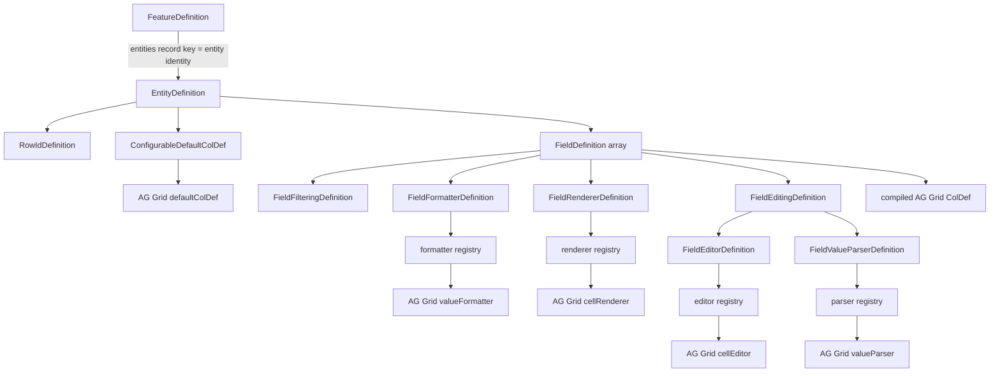

# Configurable Feature Type Hierarchy and AG Grid Mapping

Quick architecture/type map for `frontend/src/shared/grid/configurable/configuration.types.ts`.

The text hierarchy is the portable source of truth for this visual document. Mermaid remains supplemental because not every viewer renders it.

## Current hierarchy

```text
FeatureDefinition
├── featureKey
└── entities: Record<entityKey, EntityDefinition>
    │
    │  entityKey is the business/config identity
    │  e.g. "transaction", "loan", "finance"
    │
    └── EntityDefinition
        ├── labelKey
        ├── dataAdapterKey
        ├── rowId: RowIdDefinition
        │   └── path
        ├── defaultColDef?: ConfigurableDefaultColDef
        │   ├── sortable?          ← ColDef.sortable
        │   ├── initialHide?       ← ColDef.initialHide
        │   ├── initialPinned?     ← ColDef.initialPinned
        │   ├── initialWidth?      ← ColDef.initialWidth
        │   ├── initialFlex?       ← ColDef.initialFlex
        │   ├── minWidth?          ← ColDef.minWidth
        │   ├── maxWidth?          ← ColDef.maxWidth
        │   └── resizable?         ← ColDef.resizable
        └── fields: FieldDefinition[]
            ├── colId              ← ColDef.colId
            ├── field              ← ColDef.field
            ├── labelKey           → translated ColDef.headerName
            ├── cellDataType       ← ColDef.cellDataType
            ├── sortable?          ← ColDef.sortable
            ├── filtering?: FieldFilteringDefinition
            │   └── filterOptions  → filterParams.filterOptions
            ├── initialHide?       ← ColDef.initialHide
            ├── initialPinned?     ← ColDef.initialPinned
            ├── initialWidth?      ← ColDef.initialWidth
            ├── initialFlex?       ← ColDef.initialFlex
            ├── minWidth?          ← ColDef.minWidth
            ├── maxWidth?          ← ColDef.maxWidth
            ├── resizable?         ← ColDef.resizable
            ├── formatter?: FieldFormatterDefinition
            │   ├── key            → formatter registry
            │   └── params?
            ├── renderer?: FieldRendererDefinition
            │   ├── key            → renderer registry
            │   └── cellRendererParams? ← ColDef.cellRendererParams
            └── editing?: FieldEditingDefinition
                ├── editor?: FieldEditorDefinition
                │   ├── key                     → editor registry
                │   ├── cellEditorParams?       ← ColDef.cellEditorParams
                │   ├── cellEditorPopup?        ← ColDef.cellEditorPopup
                │   └── cellEditorPopupPosition?← ColDef.cellEditorPopupPosition
                └── parser?: FieldValueParserDefinition
                    ├── key            → parser registry
                    └── params?
```

## What the generics do — and do not do

A generated TypeDoc heading such as:

```text
EntityDefinition<TLabelKey, TFieldDefinition>
```

does **not** mean Transaction/Loan identity comes from those generic parameters.

```text
FeatureDefinition.entities record key
→ entity business/config identity
→ "transaction" / "loan" / "finance"

EntityDefinition<TLabelKey, TFieldDefinition>
→ only narrows allowed label keys and field shape
→ remains reusable and business-agnostic
```

Conceptually:

```text
Review Feature
├── "transaction" → EntityDefinition<...>
└── "loan"        → EntityDefinition<...>
```

## Supplemental Mermaid relationship view



## Normalization boundary

```text
backend/database representation
        ↓
validate + normalize/adapt ALWAYS
        ↓
normalized frontend configuration
        ↓
compiler + registries
        ↓
final AG Grid GridOptions / ColDef / callbacks / components
```

Normalization remains even when backend/storage names currently equal normalized frontend names.

Examples:

```text
backend sends "defaultColDef"
→ validator/normalizer accepts it
→ normalized defaultColDef

backend later sends "columnDefaults"
→ normalizer maps it
→ normalized defaultColDef

compiler does not care which backend key was used
```

Raw backend JSON is never spread directly into `AgGridReact`.

## Naming rule

```text
same AG Grid concept + same value semantics
→ use AG Grid name
→ reuse/derive AG Grid type

same final AG Grid destination but persisted value differs
→ keep explicit application descriptor name
→ resolve/map once in compiler
```

### Direct native names now used

```text
colId
field
cellDataType
sortable
defaultColDef
initialHide
initialPinned
initialWidth
initialFlex
minWidth
maxWidth
resizable
filterOptions
cellRendererParams
cellEditorParams
cellEditorPopup
cellEditorPopupPosition
```

### Custom names that remain intentionally

```text
featureKey
entities
labelKey
dataAdapterKey
rowId
filtering
formatter
renderer
editing
registry key/custom params descriptors
```

For example, `formatter` remains custom because `{ key, params }` is not an AG Grid `valueFormatter` function. `rowId` remains custom because `{ path }` is not the executable AG Grid `getRowId` callback.

## Field-to-AG-Grid mapping

```text
field.colId                         → ColDef.colId
field.field                         → ColDef.field
field.labelKey                      → translation → ColDef.headerName
field.cellDataType                  → ColDef.cellDataType
field.sortable                      → ColDef.sortable
field.initialHide                   → ColDef.initialHide
field.initialPinned                 → ColDef.initialPinned
field.initialWidth                  → ColDef.initialWidth
field.initialFlex                   → ColDef.initialFlex
field.minWidth                      → ColDef.minWidth
field.maxWidth                      → ColDef.maxWidth
field.resizable                     → ColDef.resizable
field.filtering                     → ColDef.filter + filterParams
field.filtering.filterOptions       → filterParams.filterOptions
field.formatter.key                 → registry → ColDef.valueFormatter
field.renderer.key                  → registry → ColDef.cellRenderer
field.renderer.cellRendererParams   → ColDef.cellRendererParams
field.editing presence              → composed ColDef.editable callback
field.editing.editor.key            → registry → ColDef.cellEditor
editor.cellEditorParams             → ColDef.cellEditorParams
editor.cellEditorPopup              → ColDef.cellEditorPopup
editor.cellEditorPopupPosition      → ColDef.cellEditorPopupPosition
field.editing.parser.key            → registry → ColDef.valueParser
```

## Stable column identity vs value path

```text
colId
→ stable AG Grid Column ID
→ Grid State / API identity
→ application edit/conflict/validation identity

field
→ current API row value path
```

They may differ. Requiring explicit `colId` prevents a backend field-path rename from silently changing saved column identity.

## Native column-state initialization

The old `layout` and `sizing` wrapper objects have been removed. They added organization but no separate AG Grid semantics.

Direct native leaves now represent the configuration:

```text
initialHide
initialPinned
initialWidth
initialFlex
minWidth
maxWidth
resizable
```

The `initial*` attributes seed a new column; they are not meant to continuously overwrite later user/Grid State changes. The contract follows AG Grid's native width/flex behavior rather than imposing a separate custom XOR model.

## Filtering is deliberately not called `filter`

The persisted application descriptor is:

```text
filtering: {
  filterOptions: [...]
}
```

because AG Grid `ColDef.filter` has different value semantics: it enables/selects the filter component. The compiler performs the deliberate translation:

```text
filtering descriptor
→ ColDef.filter
+ filterParams.filterOptions
```

This is an example where using an AG Grid property name would be misleading, so an application name is correct.

## Registries stay AG-Grid-typed

A registry key is configuration; the resolved implementation should still use AG Grid's real function/component contract where practical.

```text
config key
→ frontend registry
→ AG Grid-compatible implementation
→ native AG Grid property
```

## Generated API docs

TypeDoc + `typedoc-plugin-markdown` are configured through root `typedoc.json` and:

```bash
npm run docs:configurable
```

The generated API pages under `docs/configurable-feature/generated/` are source-derived detail pages. They complement this curated relationship map; they do not replace it.

Whenever `configuration.types.ts` or its JSDoc changes, regenerate the TypeDoc output before treating the generated pages as current.
