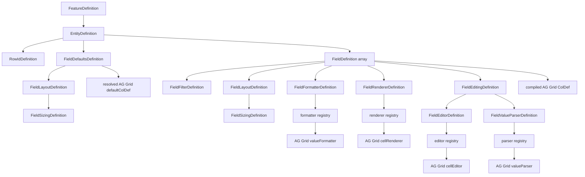

# Configurable Feature Type Hierarchy and AG Grid Mapping

Quick visual map for `frontend/src/shared/grid/configurable/configuration.types.ts`.

The curated hierarchy stays useful because it explains ownership and compiler meaning, not just TypeScript inheritance. Keep the portable text view and the rendered Mermaid view together.

## Current type hierarchy

```text
FeatureDefinition
└── entities: Record<entityKey, EntityDefinition>
    ├── labelKey
    ├── dataAdapterKey
    ├── rowId: RowIdDefinition
    │   └── path
    ├── fieldDefaults?: FieldDefaultsDefinition
    │   ├── sortable?                       ← ColDef['sortable']
    │   └── layout?: FieldLayoutDefinition
    │       ├── initialHide?                 ← ColDef['initialHide']
    │       ├── initialPinned?               ← ColDef['initialPinned']
    │       └── sizing?: FieldSizingDefinition
    │           ├── initialWidth? XOR initialFlex?
    │           ├── minWidth?
    │           ├── maxWidth?
    │           └── resizable?
    └── fields: FieldDefinition[]
        ├── id
        ├── field
        ├── labelKey
        ├── cellDataType                    ← ColDef.cellDataType-compatible
        ├── sortable?                       ← ColDef.sortable
        ├── filter?: FieldFilterDefinition
        │   └── filterOptions[]              ← AG Grid filterParams.filterOptions
        ├── layout?: FieldLayoutDefinition
        ├── formatter?: FieldFormatterDefinition
        │   ├── key
        │   └── params?
        ├── renderer?: FieldRendererDefinition
        │   ├── key
        │   └── params?
        └── editing?: FieldEditingDefinition
            ├── editor?: FieldEditorDefinition
            │   ├── key
            │   ├── params?
            │   ├── popup?
            │   └── popupPosition?
            └── parser?: FieldValueParserDefinition
                ├── key
                └── params?
```

## Rendered relationship view

GitHub renders this Mermaid diagram directly. The text hierarchy above remains the portable fallback.



## End-to-end configuration boundary

```text
frontend-supported config model
        ↓
may be stored/returned using backend/database representation
        ↓
configuration adapter / normalization
        ↓
validated normalized config
        ↓
compiler + registries
        ↓
final AG Grid options / columns / callbacks / components
```

**The normalization boundary remains even when backend/storage names currently match the normalized frontend names.** In that case normalization may be close to an identity transform, but runtime data is still validated/normalized before compilation.

Raw backend configuration never goes straight into `AgGridReact`. If backend/storage names differ later, normalize them once at the boundary. A backend property that the deployed frontend does not read/normalize/compile has no effect.

## AG Grid alignment rule

```text
same AG Grid concept + same semantics
→ keep AG Grid property name
→ reuse/derive AG Grid type where practical
→ merge/pass through instead of pointless rename-and-map code

executable AG Grid concept
→ JSON-safe key in config
→ frontend registry
→ implementation typed with real AG Grid callback/component/property type

runtime/compiler infrastructure
→ frontend creates it
→ not arbitrary persisted config
```

Examples already aligned directly:

```text
cellDataType
sortable
filterOptions
initialHide
initialPinned
initialWidth
initialFlex
minWidth
maxWidth
resizable
```

Examples that remain our concepts:

```text
featureKey
dataAdapterKey
fieldDefaults
registry key/params descriptors
access/masking
server query/save mapping
```

## Native-first compiler flow

```text
field.cellDataType
        ↓ explicit SSRM value
AG Grid ColDef.cellDataType
        ↓
AG Grid native parser / formatter / editor / renderer / filter behavior
        ↓
custom configured overrides only where required
```

Current built-in values:

```text
text
number
boolean
date           → JavaScript Date
dateString     → string date
dateTime       → JavaScript Date
dateTimeString → string date-time
```

## Field-to-AG-Grid mapping

```text
entity.fieldDefaults
    → bounded compiler/default merge
    → AG Grid defaultColDef

entity.fields[]
    → one compiled ColDef per field
```

```text
field.id                         → ColDef.colId
field.field                      → ColDef.field
field.labelKey                   → translated ColDef.headerName
field.cellDataType               → ColDef.cellDataType
field.sortable                   → ColDef.sortable
field.filter                     → ColDef.filter + filterParams
filter.filterOptions             → filterParams.filterOptions
filter omitted                   → ColDef.filter = false
layout.initialHide               → ColDef.initialHide
layout.initialPinned             → ColDef.initialPinned
layout.sizing.initialWidth       → ColDef.initialWidth
layout.sizing.initialFlex        → ColDef.initialFlex
layout.sizing.minWidth           → ColDef.minWidth
layout.sizing.maxWidth           → ColDef.maxWidth
layout.sizing.resizable          → ColDef.resizable
formatter.key                    → formatter registry → ColDef.valueFormatter
renderer.key                     → renderer registry → ColDef.cellRenderer
renderer.params                  → ColDef.cellRendererParams
editing presence                 → composed ColDef.editable callback
editing.editor.key               → editor registry → ColDef.cellEditor
editing.editor.params            → ColDef.cellEditorParams
editing.editor.popup             → ColDef.cellEditorPopup
editing.editor.popupPosition     → ColDef.cellEditorPopupPosition
editing.parser.key               → parser registry → ColDef.valueParser
```

## Table/grid-level configuration direction

The runtime schema must not be limited to only the handful of AG Grid options used in today's Transaction demo.

Preferred future structure:

```text
frontend/application defaults
        +
normalized entity-level supported AG Grid config
        ↓
resolved declarative SSRM options
        +
runtime-owned options
        +
compiled columnDefs/defaultColDef
        ↓
AgGridReact
```

A broad reviewed JSON-safe AG Grid surface may be supported using native names/types. Do not expose every executable/runtime property merely because it exists in `GridOptions`.

## Registries must use AG Grid implementation types

A registry is not permission to invent another callback API.

Conceptually:

```text
config key: "openLoan"
        ↓
cell-click registry
        ↓
implementation typed as AG Grid's onCellClicked callback type
```

Likewise formatter/parser/editor/renderer registries should resolve to AG Grid-compatible implementation types/components. Their configured params may add application-specific declarative input, but their grid-facing signatures remain AG Grid-native where practical.

## Params

```text
renderer.params → cellRendererParams
editor.params   → cellEditorParams
```

AG Grid still supplies normal runtime props such as `value`, `data`, `node`, `column` and `api`.

For formatter/parser, the compiler combines configured JSON-safe params with AG Grid's normal callback params because there is no native `valueFormatterParams` / `valueParserParams` ColDef property.

## Value/edit flow

```text
authoritative API value
        ↓
effective grid value
        ↓
cellDataType baseline
        ↓
optional formatter / renderer
        ↓
provided or custom editor
        ↓
native/custom valueParser
        ↓
LOCAL draft
        ↓
tracked editing + validation
        ↓
save mapping / backend payload   [later]
```

## Generated API docs

The intended generated-docs tooling is **TypeDoc + Markdown output** so generated API pages can be read directly in GitHub. It is not installed yet on this branch because adding a dev dependency requires a reproducibly generated `package-lock.json`; do not hand-edit the lockfile.

The curated hierarchy in this file remains even after generated docs are introduced because it explains architecture/ownership that a generated API tree does not.

## Design checklist for every new property

```text
1. Is this actually configurable product/application behavior?
2. Does AG Grid already expose the same concept?
3. If yes, can we keep its name and type?
4. Is the value JSON-safe declarative data, executable behavior, or runtime infrastructure?
5. If executable, what key/registry resolves it and what AG Grid type should that implementation use?
6. If backend/storage shape differs, where is it normalized once?
7. What exact final GridOptions / ColDef / callback/component receives it?
```
