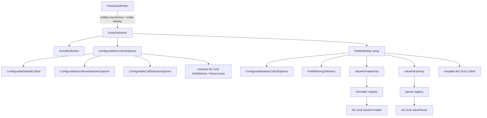

# Configurable Feature Type Hierarchy and AG Grid Mapping

Quick architecture/type map for `frontend/src/shared/grid/configurable/configuration.types.ts`.

The text hierarchy is the portable source of truth for this visual document. Mermaid remains supplemental because not every viewer renders it.

## Current hierarchy

```text
FeatureDefinition
├── featureKey
└── entities: Record<entityKey, EntityDefinition>
    │
    │  entityKey = business/config identity
    │  e.g. "transaction", "loan", "finance"
    │
    └── EntityDefinition
        ├── labelKey
        ├── dataAdapterKey
        ├── rowId: RowIdDefinition
        │   └── path
        ├── gridOptions?: ConfigurableSsrmGridOptions
        │   ├── defaultColDef?: ConfigurableDefaultColDef
        │   │   └── ConfigurableNativeColDefOptions
        │   ├── pagination / SSRM cache-loading options
        │   ├── rowSelection?: ConfigurableSsrmRowSelectionOptions
        │   ├── cellSelection?: boolean | ConfigurableCellSelectionOptions
        │   │   └── handle?: range | fill
        │   ├── native editing / navigation / undo / clipboard options
        │   ├── native column-movement options
        │   ├── row/header/presentation options
        │   ├── native tooltip options
        │   └── focus/accessibility options
        └── fields: FieldDefinition[]
            ├── colId                  ← ColDef.colId
            ├── field                  ← ColDef.field
            ├── labelKey               → translation → ColDef.headerName
            ├── cellDataType           ← ColDef.cellDataType
            ├── native ColDef options  ← ConfigurableNativeColDefOptions
            │   ├── sorting / sizing / pinning / wrapping
            │   ├── filter presentation / header controls
            │   ├── editable
            │   ├── cellEditor / cellEditorParams / popup options
            │   ├── paste / fill / import-export behavior
            │   ├── cellRenderer
            │   └── cellRendererParams
            ├── filtering?: FieldFilteringDefinition
            │   └── filterOptions      → filterParams.filterOptions
            ├── valueFormatterKey?     → formatter registry → ColDef.valueFormatter
            ├── valueFormatterConfig?
            ├── valueParserKey?        → parser registry → ColDef.valueParser
            └── valueParserConfig?
```

There is deliberately **no** configurable `editing: { editor, parser }` wrapper. Native AG Grid properties stay flat whenever their persisted values are safely representable.

## What the generics do — and do not do

```text
FeatureDefinition.entities record key
→ entity business/config identity
→ "transaction" / "loan" / "finance"

EntityDefinition<TLabelKey, TFieldDefinition>
→ only narrows allowed label keys and field shape
→ remains reusable and business-agnostic
```

## Supplemental Mermaid relationship view



## Mandatory normalization boundary

```text
backend/database representation
        ↓
validate + normalize/adapt ALWAYS
        ↓
normalized frontend configuration
        ↓
compiler + registries + runtime policy
        ↓
final AG Grid GridOptions / ColDef / callbacks / components
```

Normalization remains even when backend/storage names currently equal normalized frontend names. A backend rename is mapped once at this boundary; the compiler does not change.

## Native naming rule

```text
same AG Grid concept + same persisted value semantics
→ use AG Grid property name
→ reuse/derive AG Grid type where practical

AG Grid supports a JSON-safe registered component name
→ keep native cellEditor / cellRenderer property
→ validate the name against frontend registrations

AG Grid expects executable function/expression semantics
→ do not persist raw executable value
→ use an explicit frontend registry key/config descriptor
```

The allowlist is capability-driven, not based only on the current Transaction demo.

## Grid options: configurable vs runtime-owned

Examples of current native configurable grid properties:

```text
defaultColDef
pagination / paginationAutoPageSize / paginationPageSize
cacheBlockSize / maxBlocksInCache / serverSideInitialRowCount
rowSelection
cellSelection
invalidEditValueMode
singleClickEdit / suppressClickEdit
enterNavigatesVertically / enterNavigatesVerticallyAfterEdit
undoRedoCellEditing
suppressClipboardPaste
suppressMovableColumns / suppressMoveWhenColumnDragging
rowHeight / rowBuffer / headerHeight / animateRows
tooltipShowDelay / tooltipHideDelay / tooltipInteraction
suppressCellFocus / suppressHeaderFocus / ensureDomOrder
```

Runtime/bundle infrastructure remains frontend-owned even though `AgGridReact` accepts it as props:

```text
modules
rowModelType
serverSideDatasource
columnDefs
context
getRowId callback
event callbacks
GridApi refs
business callbacks such as isRowSelectable
```

## Native flat-SSRM row selection

The normalized native selection type intentionally reflects SSRM semantics:

```text
mode = singleRow | multiRow
checkboxes = static boolean branch
enableClickSelection
copySelectedRows
...

multiRow:
groupSelects = self
selectAll = all
headerCheckbox
ctrlASelectsRows
```

`isRowSelectable` is runtime business policy.

AG Grid treats `rowSelection.selectAll='filtered'|'currentPage'` as invalid for SSRM, so those are not accepted as native config. The repository's All Filtered / Current Page operations remain application-owned semantics.

## Editing mapping after the native-first SSRM spike

```text
normal cell edit
Cell Selection
Ctrl/Cmd+D
Ctrl/Cmd+Enter
Fill Handle
clipboard/paste
        ↓
AG Grid applies native editable rules
        ↓
cellValueChanged
        ↓
shared BASE + LOCAL draft observer
```

The configurable contract therefore describes native behavior:

```text
field.editable                  → composed ColDef.editable
field.cellEditor                → ColDef.cellEditor
field.cellEditorParams          → ColDef.cellEditorParams
field.cellEditorPopup           → ColDef.cellEditorPopup
field.cellEditorPopupPosition   → ColDef.cellEditorPopupPosition
field.singleClickEdit           → ColDef.singleClickEdit
field.suppressPaste             → ColDef.suppressPaste
field.suppressFillHandle        → ColDef.suppressFillHandle
field.useValueParserForImport   → ColDef.useValueParserForImport
field.useValueFormatterForExport→ ColDef.useValueFormatterForExport

gridOptions.cellSelection      → GridOptions.cellSelection
gridOptions.invalidEditValueMode
                                → GridOptions.invalidEditValueMode
gridOptions.suppressClipboardPaste
                                → GridOptions.suppressClipboardPaste
```

## Registered component names vs executable registries

```text
cellEditor: "transactionAccountEditor"
cellRenderer: "statusChip"
```

These are native registered-component names. Frontend runtime owns actual implementations.

Formatter/parser are different:

```text
valueFormatterKey
→ frontend formatter registry
→ ColDef.valueFormatter

valueParserKey
→ frontend parser registry
→ ColDef.valueParser
```

Raw AG Grid expression strings are not accepted from backend configuration.

## Filtering remains a deliberate custom descriptor

```text
field.filtering
→ server-supported query capability
→ compiler selects appropriate ColDef.filter
→ filtering.filterOptions → filterParams.filterOptions
```

Native filter presentation such as `floatingFilter` can still remain native. Runtime validation must reject contradictory combinations where filter presentation is enabled but the field has no supported server filtering capability.

## Grid-level merge structure

```text
application configurable-SSRM defaults
        +
entity.gridOptions overrides
        ↓
resolved GridOptions

resolved GridOptions.defaultColDef
        +
individual FieldDefinition native properties
        ↓
final ColDef
```

Exact nested merge behavior for `defaultColDef`, `cellSelection` and `rowSelection` is the next compiler/defaults design batch.

## Runtime editing state is not configuration

```text
rowId
└── dirty field
    ├── baseValue
    └── value
```

The merged spike's BASE+LOCAL state is runtime/shared infrastructure. Dirty counts, selected∩dirty calculation, Save acknowledgement, SSRM draft restoration and Discard refresh behavior are not persisted metadata.

## Generated API docs

TypeDoc + `typedoc-plugin-markdown` are configured through root `typedoc.json` and:

```bash
npm run docs:configurable
```

Whenever `configuration.types.ts` or its JSDoc changes, regenerate `docs/configurable-feature/generated/` before treating generated API pages as current.
