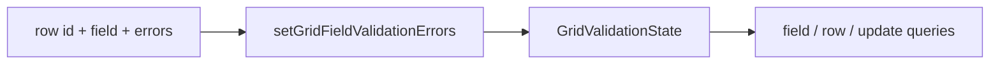
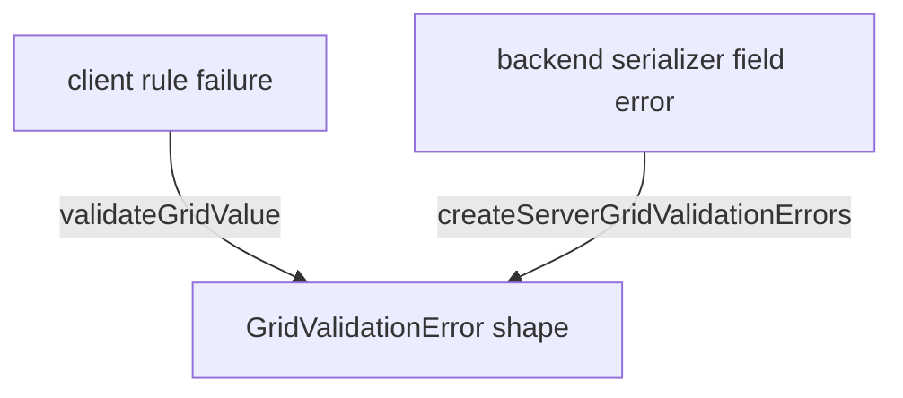

# Grid Validation

## Purpose

Grid validation is a shared frontend capability for validating editable field values without putting Transaction business rules into shared AG Grid code.

The current implementation separates three responsibilities:

```text
feature rule selection/messages
→ shared rule execution
→ shared validation error/state primitives
```

Backend validation remains authoritative for persisted writes. Frontend validation exists to provide immediate field-level validation semantics and reusable save-guard state as the capability is integrated with tracked editing.

## At-a-glance ownership and call chain

The three production frontend files introduced for the validation foundation have deliberately different responsibilities:

```mermaid
flowchart TD
    A[transactionValidation.ts<br/>Transaction-owned rules + messages]
    B[gridValidation.ts<br/>shared rule execution + validation state helpers]
    C[defaultGridValidationRules.ts<br/>registered executable validators]
    D[GridValidationError[]<br/>client validation result]

    A -->|validateTransactionField field value| B
    B -->|lookup rule.key| C
    C -->|valid / invalid result| B
    B --> D
```

The important dependency direction is:

```text
Transaction feature
        │
        │ chooses rule keys, params and messages
        ▼
shared validation engine
        │
        │ resolves keys through a frontend-owned registry
        ▼
registered domain-neutral validators
        │
        ▼
normalized field errors
```

`shared/grid` never imports Transaction rules. The Transaction feature imports the shared engine and registry because the feature owns the business choice of which rules apply.

## Current implementation layers

### 1. Shared validation engine

`frontend/src/shared/grid/validation/gridValidation.ts`

Owns domain-neutral validation contracts and state helpers:

- resolved rule shape (`key`, JSON-safe `params`, optional `message`);
- validator registry contract;
- execution of rules against one effective field value;
- normalized client/server validation error shape;
- stable row-ID + field validation state;
- queries for field, row and update-level validation errors.

This layer does not know Transaction fields, Transaction messages or backend serializer classes.

### 2. Default validator registry

`frontend/src/shared/grid/validation/defaultGridValidationRules.ts`

Owns executable frontend validator functions for the currently registered shared rule keys:

```text
required
maxLength
numberRange
```

Rules reference these validators by stable string key. Configuration supplies data only; it does not supply executable JavaScript or expressions.

### 3. Transaction validation configuration

`frontend/src/features/transactions/grid/transactionValidation.ts`

Owns the concrete Transaction field rules and user-facing messages.

The feature chooses which shared validators apply to each editable Transaction field, then delegates execution back to the shared engine.

This keeps business/domain choices out of `shared/grid` while still reusing one validation mechanism.

## Exact function-level working

For a Transaction field validation call, the implemented flow is:

```text
validateTransactionField(field, value)
        │
        ▼
TRANSACTION_VALIDATION_RULES[field]
(transactionValidation.ts)
        │
        │ rules + params + Transaction message
        ▼
validateGridValue(value, rules, defaultGridValidatorRegistry)
(gridValidation.ts)
        │
        ├── iterate resolved rules
        ├── find validator by rule.key
        ▼
defaultGridValidatorRegistry[rule.key]
(defaultGridValidationRules.ts)
        │
        ├── execute registered validator
        └── return { valid, defaultMessage? }
        │
        ▼
validateGridValue(...)
        │
        ├── valid rule → no error added
        └── invalid rule → GridValidationError added
        │
        ▼
GridValidationError[]
source = "client"
```

Example:

```text
field = account
value = ""

transactionValidation.ts
→ required
→ maxLength { max: 100 }

validateGridValue(...)
→ required validator returns invalid
→ maxLength validator returns valid

result
→ [{ source: "client", ruleKey: "required", message: "Account is required." }]
```

The shared engine deliberately fails if a rule key is not present in the supplied registry:

```text
unknown rule key
→ throw "Unknown grid validation rule: ..."
```

That makes configuration mistakes visible rather than silently skipping required validation.

## Rule data versus executable code

The rule definition is data:

```text
{
  key: "maxLength",
  params: { max: 100 },
  message: "Account must be 100 characters or fewer."
}
```

The executable validator exists only in the frontend registry:

```text
"maxLength"
→ defaultGridValidatorRegistry.maxLength
```

This is intentional. A backend/configurable-table layer may eventually provide resolved JSON-safe rule data, but it must not provide arbitrary JavaScript or expressions for execution in the browser.

## Validation state model

Validation state is keyed by stable backend row ID and editable field, not by transient AG Grid `RowNode` identity:

```text
validationState[rowId][field]
→ one or more validation errors
```

Each error records:

```text
message
source = client | server
ruleKey?   // present for registered client rules when applicable
```

The state-helper flow in `gridValidation.ts` is:



`gridValidation.ts` currently provides helpers to:

- set/replace a field's errors;
- remove a field entry automatically when it becomes valid;
- clear all validation errors for one row;
- query field-level and row-level invalid state;
- determine whether an explicit update payload contains an invalid field;
- normalize backend field messages into the same error shape with `source: "server"`.

This state shape remains independent of RowNode lifetime. That is required because:

```text
Client
→ authoritative rowData objects can be replaced

Infinite
→ cache blocks / RowNodes can be recreated or evicted

SSRM
→ server-side store rows / RowNodes can be recreated
```

The durable validation key is therefore the backend row ID plus field.

## Current Transaction rules

The current frontend rules are:

| Field | Rules |
| --- | --- |
| `account` | required; maximum 100 characters |
| `amount` | numeric range 0 through 1,000,000 |
| `currency` | required; maximum 3 characters |
| `status` | required |

`status` is additionally constrained by the backend serializer's allowed choices.

## Backend authority

`backend/apps/transactions/api/serializers.py` enforces the persisted Transaction write contract.

The current backend constraints align with the concrete frontend rules for account, amount and currency, while DRF continues to own authoritative type/choice validation.

The two layers have different responsibilities:

```text
frontend validation
→ immediate field validation semantics and client-side mutation guards

backend validation
→ authoritative acceptance/rejection of persisted writes
```

A backend rejection must never be treated as impossible merely because frontend validation previously passed.

## Client and server errors use one shape

Client rules produce errors through `validateGridValue(...)`.

Backend field messages can be converted through `createServerGridValidationErrors(...)` so presentation and save-state logic can consume one field-error model without pretending a server error came from a frontend rule.



The source remains explicit:

```text
client rule failure
→ source: "client"
→ optional ruleKey

backend serializer rejection
→ source: "server"
→ backend message
```

## Relationship to tracked editing

Tracked editing and validation are separate state concerns.

Tracked editing currently owns:

```text
BASE / LOCAL / REMOTE
changesById
originalsById
conflictsById
```

Validation owns whether the effective editable value is acceptable.

A field can therefore be dirty, invalid and/or conflicted independently. Validation must not be encoded as conflict state, and conflict state must not be inferred from validation errors.

Current ownership is:

```text
trackedGridEditing
→ what LOCAL work exists and how BASE/LOCAL/REMOTE reconcile

GridValidationState
→ whether a field's effective value currently has validation errors
```

## What is implemented now versus not yet wired

Implemented in the current validation foundation:

```text
Transaction static rules/messages
→ shared registered validator execution
→ normalized client errors
→ stable row-id/field validation state helpers
→ normalized server error shape
→ matching authoritative DRF constraints
```

Not yet integrated at the current PR state:

```text
AG Grid direct edit event
→ validate edited LOCAL value
→ write GridValidationState

current-page programmatic edit
→ same validation lifecycle

Row Save / Save Selected
→ consult exact validation state before mutation

backend rejected write
→ map returned serializer field errors into the same live state

Discard / correction / conflict resolution
→ revalidate or clear the correct field state

cell presentation
→ invalid styling / message alongside conflict presentation
```

Those integrations must be implemented before this document describes them as current runtime behavior.

## Implementation entry points

```text
frontend/src/shared/grid/validation/gridValidation.ts
→ shared validation contracts, execution and stable error-state helpers

frontend/src/shared/grid/validation/defaultGridValidationRules.ts
→ registered domain-neutral executable validators

frontend/src/features/transactions/grid/transactionValidation.ts
→ Transaction-owned rule selection and messages

backend/apps/transactions/api/serializers.py
→ authoritative persisted-write validation
```

Focused tests currently live at:

```text
frontend/src/shared/grid/validation/gridValidation.test.ts
frontend/src/features/transactions/grid/transactionValidation.test.ts
backend/apps/transactions/tests/test_validation_api.py
```

## Verification expectations

The foundation tests verify:

1. registered rules execute through stable keys;
2. custom feature messages override default validator messages;
3. malformed rule parameters fail predictably;
4. unknown rule keys fail predictably;
5. validation state is stored by stable row ID + field;
6. valid correction removes stale field errors;
7. update-level invalid detection checks only fields actually present in the update;
8. backend messages normalize into server-sourced field errors;
9. Transaction concrete rules accept/reject representative values;
10. DRF enforces the corresponding authoritative write constraints.
